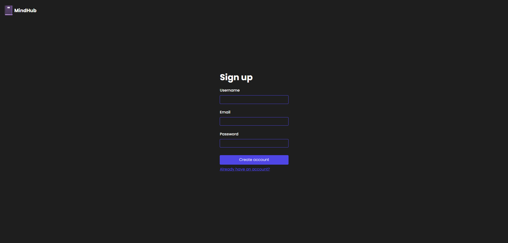
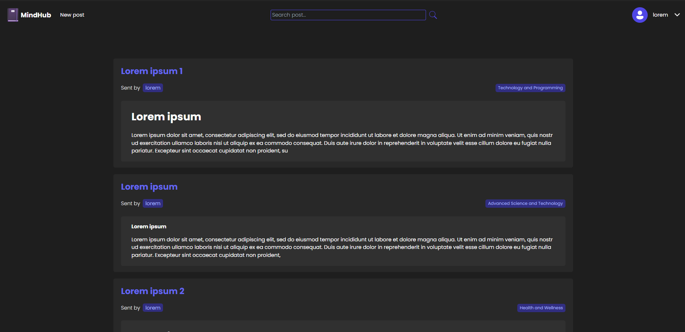
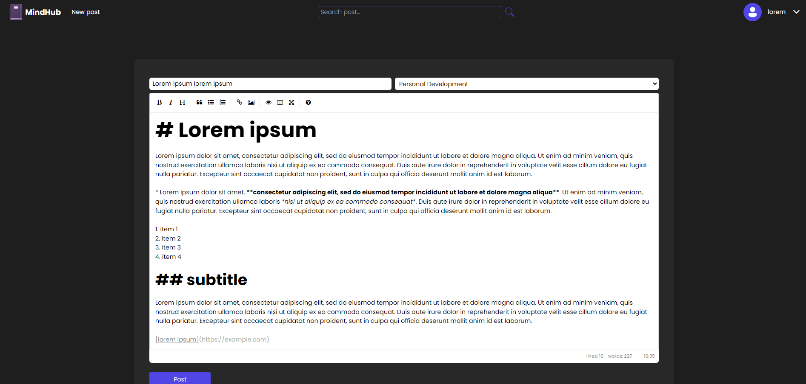
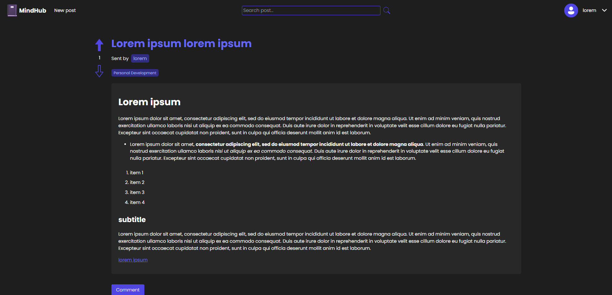
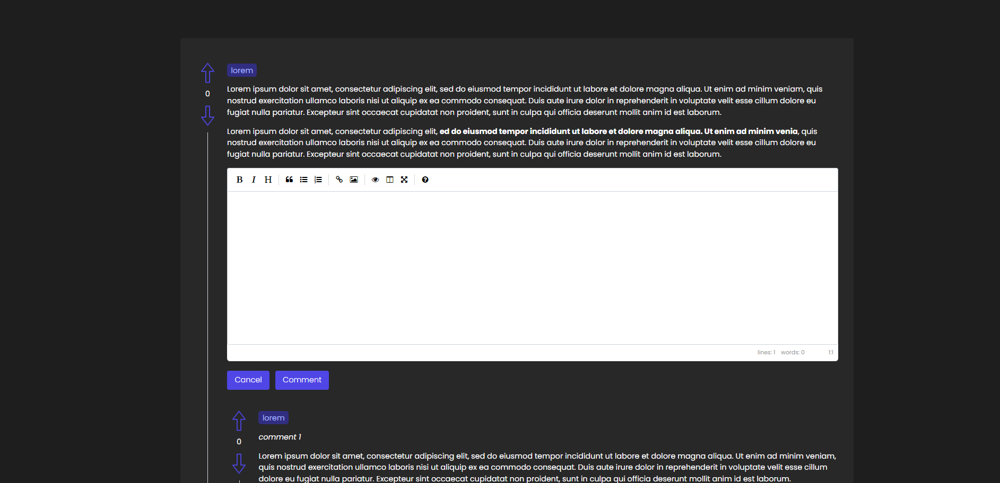
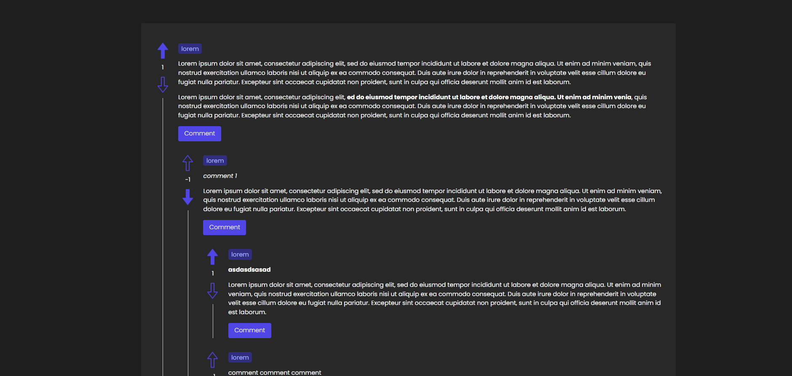
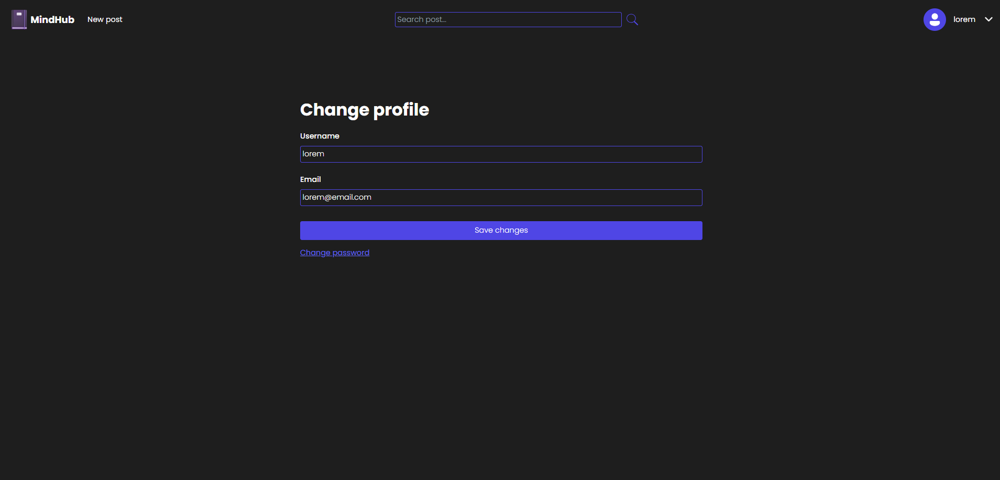

⚠️ Em desenvolvimento

# MindHub
MindHub é um fórum designado para estudantes compartilharem suas ideias, dicas, conteúdos, resumos e tudo relacionado a estudos.

Disponível em: [https://mindhub-theta.vercel.app/](https://mindhub-theta.vercel.app/)

## Tecnologias utilizadas
- React (Typescript)
- Spring Boot
- MySQL

## Imagens














## Como contribuir?

Primeiro, clone o projeto usando:
```
git clone https://github.com/rodrigovalest/mindhub.git
```

### Configurando backend
- A partir da raíz do projeto, entre no diretório `/backend/src/main/resources` copie o arquivo `example.application.properties` e cole com o seguinte nome `application.properties`.
- Dentro desse arquivo preencha com as informações do seu ambiente, com informações do banco de dados, chave privada para gerar tokens nos endpoints e o url do frontend para segurança do CORS (em ambiente de desenvolvimento, coloque `http://localhost:3000`).

### Configurando frontend
- A partir da raíz do projeto, entre no diretório `/frontend`.
- Copie o arquivo `.env.example` e coloque com o nome `.env`.
- Nele, coloque a url da aplicação backend (em ambiente de desenvolvimento, coloque `http://localhost:8080`).
- Agora baixe as dependências, usando `npm install`.
- Por fim, inicie a aplicação utilizando `npm start`.
